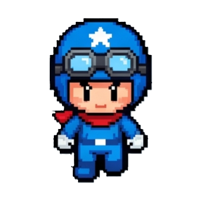
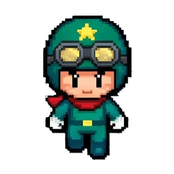
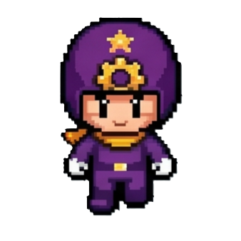
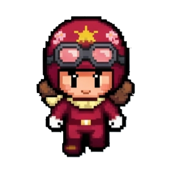
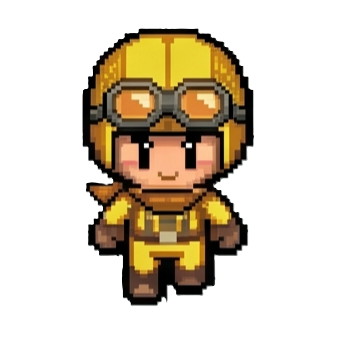

# LAN Bomber

LAN 환경에서 같은 네트워크의 플레이어끼리 접속해서 즐기는 Bomberman 스타일 멀티플레이 게임입니다.

- `Node.js` 기반 권한 서버 (authoritative server)
- `HTTP + WebSocket` 실시간 통신
- `UDP` 브로드캐스트 기반 LAN 룸 자동 발견
- `TypeScript` 공용 프로토콜/스키마 공유

## Character Design Update

<p align="center">
  
  
  
</p>
<p align="center">
  
  
  
</p>

> Character images in this README are generated by Gemini.

---

## 목차

1. [요구사항](#요구사항)
2. [빠른 시작](#빠른-시작)
3. [수동 실행](#수동-실행)
4. [개발 환경 실행](#개발-환경-실행)
5. [빌드](#빌드)
6. [서버 옵션](#서버-옵션)
7. [프로젝트 구조](#프로젝트-구조)
8. [아키텍처](#아키텍처)
9. [클라이언트↔서버 통신 상세](#클라이언트서버-통신-상세)
10. [게임 기능](#게임-기능)
11. [네트워크 요구사항](#네트워크-요구사항)
12. [사용 기술](#사용-기술)
13. [라이선스](#라이선스)

---

## 요구사항

| 항목 | 버전 |
|---|---|
| Node.js | `20.x` (권장: `20.11.1`) |
| npm | `10.x` 이상 |

> [Volta](https://volta.sh/)를 사용하면 `package.json`의 `volta` 필드에 명시된 Node.js 버전이 자동 적용됩니다.

---

## 빠른 시작

### Windows (권장)

저장소 루트에 있는 런처 스크립트를 실행합니다.

```bat
launch.bat
```

또는 PowerShell에서 직접 실행합니다.

```powershell
powershell -ExecutionPolicy Bypass -File launch.ps1
```

런처가 자동으로 수행하는 작업은 다음과 같습니다.

1. 포트 번호 입력 (기본값: `3000`)
2. 방 이름 입력 (기본값: `LAN Bomber Room`)
3. `npm install` — 전체 의존성 설치
4. `shared` 패키지 빌드
5. `client` 정적 파일 빌드
6. 서버 시작
7. 브라우저 자동 열기 (`http://localhost:<port>`)

### 다른 PC에서 접속

서버가 시작되면 같은 LAN에 있는 다른 PC의 브라우저에서 아래 주소로 접속합니다.

```
http://<서버_PC의_로컬_IP>:3000
```

서버 PC의 로컬 IP는 `ipconfig` (Windows) 또는 `ip addr` (Linux/Mac) 명령으로 확인합니다.

---

## 수동 실행

### 1단계 — 의존성 설치

```bash
npm install
```

### 2단계 — shared 빌드

```bash
npm run build:shared
```

### 3단계 — client 정적 파일 빌드

```bash
npm run build:client
```

### 4단계 — 서버 실행

```bash
npm run dev:server
```

서버가 시작되면 터미널에 바인딩된 IP 주소와 포트가 출력됩니다.  
기본 주소: `http://localhost:3000`

### 포트/방 이름 변경

환경 변수 또는 CLI 인자를 사용합니다.

```bash
# 환경 변수 방식
WS_PORT=4000 ROOM_NAME="우리방" npm run dev:server

# CLI 인자 방식 (서버 패키지에서 직접 실행)
npm --prefix server run dev -- --port 4000 --room "우리방"
```

---

## 개발 환경 실행

서버와 클라이언트를 동시에 watch 모드로 실행하려면 터미널 두 개를 엽니다.

**터미널 1 — 서버 (tsx watch)**

```bash
npm run dev:server
```

`shared` 빌드 → `client` 빌드 → 서버 watch 순서로 실행됩니다.  
서버 소스(`server/src/**`)가 변경되면 자동 재시작됩니다.

**터미널 2 — 클라이언트 (esbuild watch)**

```bash
npm run dev:client
```

`shared` 빌드 → 클라이언트 watch 순서로 실행됩니다.  
렌더러 소스(`client/src/**`)가 변경되면 `client/dist/renderer.js`가 자동 재빌드됩니다.  
브라우저를 새로고침하면 변경 사항이 반영됩니다.

---

## 빌드

### 전체 프로덕션 빌드

```bash
npm run build:shared
npm run build:server
npm run build:client
```

### 서버 단독 실행 (빌드 후)

```bash
npm --prefix server run start
# 또는
node server/dist/index.js
```

### 타입 검사

```bash
npm run typecheck
```

`shared`, `server`, `client` 세 패키지의 TypeScript 타입을 한 번에 검사합니다.

---

## 루트 스크립트 요약

| 스크립트 | 설명 |
|---|---|
| `npm run build:shared` | `shared` 패키지 컴파일 |
| `npm run build:server` | `server` 패키지 컴파일 |
| `npm run build:client` | `client` 정적 파일 번들 |
| `npm run typecheck` | 전체 타입 검사 |
| `npm run dev:server` | shared+client 빌드 후 서버 watch 실행 |
| `npm run dev:client` | shared 빌드 후 클라이언트 watch 실행 |

---

## 서버 옵션

서버 진입점 `server/src/index.ts`는 다음 옵션을 지원합니다.

| CLI 인자 | 환경 변수 | 기본값 | 설명 |
|---|---|---:|---|
| `--port` | `WS_PORT` | `3000` | HTTP + WebSocket 포트 |
| `--room` | `ROOM_NAME` | `LAN Bomber Room` | 방 이름 |
| `--udpPort` | `UDP_PORT` | `41234` | UDP 발견 브로드캐스트 포트 |
| `--no-udp` | — | — | UDP 자동 발견 비활성화 |
| `--log` | `LOG_LEVEL` | `info` | 로그 레벨 (`info` \| `debug`) |

---

## 프로젝트 구조

```
lan-bomber/
├─ shared/          공용 타입, 메시지 스키마, 상수, 맵 데이터
│  └─ src/
│     ├─ constants.ts   tick rate, 포트, 기본 스탯, 아이템 확률
│     ├─ messages.ts    클라이언트↔서버 메시지 타입 정의
│     ├─ schema.ts      메시지 직렬화/파싱 및 검증
│     ├─ maps.ts        맵 프리셋 로딩
│     ├─ rng.ts         결정적 난수 (시뮬레이션 동기화용)
│     └─ logger.ts      공통 로거
│
├─ server/          게임 권한 서버
│  └─ src/
│     ├─ index.ts               진입점, CLI 인자 파싱
│     └─ game/
│        ├─ LanBomberServer.ts  Express + WS + UDP 서버 본체
│        └─ systems/
│           ├─ movement.ts      이동 판정
│           ├─ balloons.ts      폭탄/폭발 처리
│           ├─ items.ts         아이템 드랍/획득
│           └─ rescue.ts        트랩/구출 판정
│
├─ client/          정적 클라이언트 (브라우저용)
│  └─ src/
│     ├─ renderer/
│     │  ├─ index.ts      WebSocket 연결, 입력 루프, 렌더 루프
│     │  ├─ gameView.ts   Canvas 2D 게임 화면 렌더링
│     │  ├─ lobbyView.ts  로비/결과 화면 DOM 조작
│     │  ├─ input.ts      키보드 입력 컨트롤러
│     │  ├─ state.ts      클라이언트 게임 상태 타입
│     │  └─ dom.ts        DOM 요소 참조 관리
│     ├─ index.html
│     └─ styles.css
│
├─ assets/         이미지, 이펙트, 캐릭터 리소스
├─ launch.bat       Windows 원클릭 런처
├─ launch.ps1       PowerShell 런처 본체
├─ LICENSE
└─ package.json
```

---

## 아키텍처

### 권한 서버 구조

게임의 모든 판정은 서버에서 이루어집니다. 클라이언트는 입력 전송과 렌더링만 담당합니다.

```
클라이언트                         서버
────────────────────               ──────────────────────────────────
키 입력 (60 Hz)  ──── Input ────▶  이동/폭탄/아이템/보스 판정 (60 Hz)
보간 렌더링     ◀─── Snapshot ───  상태 브로드캐스트 (20 Hz)
이벤트 처리     ◀─── Event ──────  폭발/사망/아이템/보스 레이저 이벤트
채팅 메시지     ◀─── Chat ───────  채팅 브로드캐스트
```

| 항목 | 값 |
|---|---|
| 서버 시뮬레이션 tick | 60 Hz (`TICK_RATE = 60`) |
| 스냅샷 브로드캐스트 | 20 Hz (`SNAPSHOT_RATE = 20`) |
| 클라이언트 입력 전송 | 60 Hz (`INPUT_SEND_RATE = 60`) |
| 스냅샷 보간 창 | `dtTicks × (1000 / 60)` ms |

### 게임 페이즈 상태 머신

```
lobby ──(StartRequest)──▶ starting ──(startTick 도달)──▶ inGame ──(라운드 종료)──▶ postGame
  ▲                                                                                      │
  └──────────────────────────────── 모든 플레이어 퇴장 시 즉시 리셋 ────────────────────┘
```

| 페이즈 | 설명 |
|---|---|
| `lobby` | 방 대기실. 준비/설정 가능 |
| `starting` | 게임 시작 카운트다운 (~1초). 이미 StartGame 메시지 전송 완료 |
| `inGame` | 게임 진행 중. Input 처리, Snapshot·Event 브로드캐스트 |
| `postGame` | 라운드 종료 직후. Snapshot만 전송, 곧 lobby로 복귀 |

---

## 클라이언트↔서버 통신 상세

모든 메시지는 `{ type: string, payload: object }` 형태의 JSON으로 직렬화됩니다.  
공용 스키마는 `shared/src/messages.ts`에 정의되어 있으며, 파싱·검증 로직은 `shared/src/schema.ts`에 있습니다.

### 연결 및 입장 핸드셰이크

```
클라이언트                                          서버
──────────                                          ──────
TCP 3-way handshake (HTTP Upgrade)
WebSocket 연결 확립  ─────────────────────────────▶ 플레이어 UUID 발급, 색상 슬롯 배정
                    ◀──── Welcome ─────────────────  { playerId, protocol: 1 }
                    ◀──── RoomState ───────────────  현재 방 전체 상태 전송
JoinRoom 전송        ──────────────────────────────▶ 플레이어 이름 등록
                                                     (방장이면 방 이름도 설정 가능)
                    ◀──── RoomState ───────────────  이름 반영된 방 상태 재전송
SetSkin 전송         ──────────────────────────────▶ (선택) localStorage에서 복원한 스킨 적용
                    ◀──── RoomState ───────────────  스킨 반영된 방 상태 재전송
```

> 연결 시 `phase === 'inGame' | 'postGame'`이면 서버가 `ServerError`를 보내고 즉시 소켓을 닫습니다.  
> 최대 6명 초과 시에도 동일하게 거부됩니다.

### 로비 단계 — 클라이언트 → 서버

| 메시지 | 페이로드 | 권한 | 설명 |
|---|---|---|---|
| `JoinRoom` | `{ name, roomName? }` | 전체 | 닉네임 설정. 방장이면 방 이름도 변경 |
| `Ready` | `{ isReady: boolean }` | 전체 | 준비 상태 토글 |
| `SetMode` | `{ mode: 'FFA'\|'TEAM'\|'BOSS' }` | 방장 | 게임 모드 변경. BOSS 선택 시 `boss_arena` 맵 자동 설정 |
| `SetMap` | `{ mapId: string }` | 방장 | 맵 변경 (`map1`~`map6`, `boss_arena`) |
| `SetGameDuration` | `{ seconds: 0\|30\|60…300 }` | 방장 | 제한시간 설정 (0 = 무제한) |
| `SetBossType` | `{ bossType: 'boss1'\|'boss2'\|'random' }` | 방장 | BOSS 모드 보스 유형 선택 |
| `SetTeam` | `{ team: 0\|1 }` | 전체 | TEAM 모드에서 팀 변경 (3v3 상한 적용) |
| `ShuffleTeams` | `{}` | 방장 | 팀 무작위 재배정 (준비 상태 초기화) |
| `SetSkin` | `{ skin: string }` | 전체 | 캐릭터 스킨 변경 |
| `StartRequest` | `{}` | 방장 | 게임 시작 요청 (전원 준비 완료 필요) |

### 로비 단계 — 서버 → 클라이언트

| 메시지 | 설명 |
|---|---|
| `Welcome` | `{ playerId, protocol }` — 최초 연결 시 1회 전송 |
| `RoomState` | `{ players[], readyStates, hostId, mode, mapId, gameDurationSeconds, bossType }` — 방 상태 변경 시마다 전원에게 브로드캐스트 |
| `StartGame` | `{ seed, mapId, startTick, mode, gameDurationSeconds, playerColors, playerSkins }` — 게임 시작 시 전원에게 1회 전송 |
| `ServerError` | `{ message }` — 오류 발생 시 해당 클라이언트에게만 전송 |

### 게임 중 — 클라이언트 → 서버 (60 Hz)

```
매 프레임 (≈16.7ms):
  Input {
    seq: number,          // 단조증가 시퀀스 번호 (중복/역순 제거)
    tick: number,         // 클라이언트 추정 서버 tick
    moveDir: 'None'|'Up'|'Down'|'Left'|'Right',
    placeBalloon: boolean,
    useItemSlot: -1|0|1|2|3|4  // -1 = 사용 안함, 0~4 = 인벤토리 슬롯
  }
```

- 서버는 `seq <= lastInputSeq`인 패킷을 무시하여 역순/중복 입력을 방어합니다.
- `placeBalloon: true`가 연속으로 오면 최대 3개까지 큐에 누적됩니다.

### 게임 중 — 서버 → 클라이언트

#### Snapshot (20 Hz, 매 3 tick마다)

전체 게임 상태를 브로드캐스트합니다.

```typescript
{
  tick: number,
  players: PlayerSnapshot[],   // 위치, 상태, 스탯, 인벤토리
  balloons: BalloonSnapshot[], // 폭탄 위치, 폭발 예정 tick
  explosions: ExplosionSnapshot[], // 폭발 범위 타일 목록
  items: ItemSnapshot[],       // 맵 위 아이템
  blocks: BlockSnapshot[],     // 남은 소프트블록 (변경 시 캐시 무효화)
  deathOrder: PlayerId[],      // 사망 순서 (index 0 = 최초 사망)
  timeLeftSeconds: number,     // 남은 시간 (-1 = 무제한)
  boss?: BossSnapshot          // BOSS 모드 전용
}
```

클라이언트는 Snapshot 두 개(prev, curr) 사이를 선형 보간(lerp)하여 렌더링합니다.  
보간 시간은 `dtTicks × (1000 / TICK_RATE)` ms로 계산됩니다.

#### Event (비동기, 발생 즉시)

Snapshot에 포함되지 않는 일회성 사건을 알립니다.

| `type` | `payload` 주요 필드 | 설명 |
|---|---|---|
| `BalloonPlaced` | `balloonId, ownerId, x, y, explodeTick` | 폭탄 설치 |
| `BalloonExploded` | `balloonId, x, y, tiles[]` | 폭탄 폭발 (연쇄 포함) |
| `BalloonKicked` | `balloonId, fromX, fromY, x, y, kickerId` | 장갑으로 폭탄 밀기 |
| `BlockDestroyed` | `x, y` | 소프트블록 파괴 |
| `ItemSpawned` | `id, x, y, itemType` | 아이템 드랍 |
| `ItemPicked` | `itemId, playerId` | 아이템 획득 |
| `PlayerTrapped` | `playerId, x, y` | 플레이어 트랩 상태 진입 |
| `PlayerRescued` | `playerId, byPlayerId` | 플레이어 구출 (또는 바늘로 자가 탈출) |
| `PlayerDied` | `playerId` | 플레이어 사망 |
| `BossHit` | `hp, phase` | 보스 피격 |
| `BossDefeated` | — | 보스 처치 |
| `BossLaser` | `hTiles[], vTiles[], endTick` | BOSS2 레이저 발사 |
| `ServerNotice` | `text` | 서버 공지 (시스템 메시지) |
| `RoundEnded` | `mode, ranking[], winnerId?, winnerTeam?, victory?` | 라운드 종료 및 결과 |

#### Chat

```typescript
// 클라이언트 → 서버
ChatSend { text: string }  // 최대 100자, 공백 trim

// 서버 → 전체 브로드캐스트
Chat { playerId, playerName, colorIndex, text }
```

#### Ping / Pong (레이턴시 측정)

```typescript
// 클라이언트 → 서버
Ping { clientTime: number }  // performance.now() 기준

// 서버 → 클라이언트
Pong { clientTime: number, serverTime: number, tick: number }
// 클라이언트: pingMs = performance.now() - clientTime
// 클라이언트: serverTick = tick (서버 tick 동기화)
```

### LAN 자동 발견

두 가지 방식이 병행됩니다.

#### UDP 브로드캐스트 (기본, 1초 주기)

```
서버 ──── UDP broadcast (255.255.255.255:41234) ────▶ 같은 서브넷 전체

ServerAnnounce {
  roomName: string,
  playerCount: number,
  wsPort: number,
  hostIpHint: string,  // 예: "192.168.0.10"
  mode: GameMode,
  mapId: string
}
```

서버는 LAN IP 후보 중 Wi-Fi → Ethernet → 기타 우선순위로 `hostIpHint`를 결정합니다.

#### HTTP Probe (브라우저 클라이언트 대체 수단)

일반 브라우저는 UDP를 사용할 수 없으므로, 로컬 IP 대역(예: `192.168.x.1~254`)에 HTTP 요청을 순차적으로 보내 룸을 탐색합니다.

```
클라이언트 ── GET http://192.168.x.y:<port>/api/room ──▶ 서버
            ◀── JSON { roomName, playerCount, wsPort,
                       hostIpHint, mode, mapId, phase } ──
```

CORS Private Network Access 헤더(`Access-Control-Allow-Private-Network: true`)를 포함합니다.

### 프로토콜 버전 관리

`shared/src/constants.ts`의 `PROTOCOL_VERSION = 1` 상수를 사용합니다.  
서버는 `Welcome` 메시지에 버전을 포함하여 전송하며, 클라이언트가 불일치를 감지하면 연결을 끊을 수 있습니다.

---

## 게임 기능

- 최대 **6명** 동시 플레이
- **FFA** (자유 전투) 모드
- **TEAM 3v3** 모드
- **BOSS** 모드 — 보스 패턴 및 레이저 공격
- 방장 전용 모드/맵/제한시간 설정
- 준비 완료 시스템
- 실시간 채팅
- 캐릭터 스킨 변경
- 아이템 시스템 (Speed, Balloon, Power, Needle, Shield, Glove, Switch — 5슬롯 인벤토리)
- 폭탄, 폭발, 벽 파괴, 연쇄 폭발
- 구출/트랩 상태, 바늘 자가 탈출
- 라운드 종료 후 결과 랭킹

### 아이템 상세

| 아이템 | 확률 | 효과 |
|---|---|---|
| Speed | 18% | 이동 속도 +0.5 (최대 6.0) |
| Balloon | 18% | 최대 폭탄 수 +1 (최대 6) |
| Power | 18% | 폭발 범위 +1 (최대 6) |
| Needle | 12% | 인벤토리 저장. 트랩 상태에서 사용 시 자가 탈출 |
| Glove | 13% | 즉시 적용. 이동 방향의 폭탄 밀기 가능 |
| Shield | 12% | 인벤토리 저장. 사용 시 20초간 폭발 무적 |
| Switch | 9% | 즉시 적용. 적용된 플레이어의 조작 방향이 15초간 반전 |

### 맵 프리셋

`shared/src/maps/*.json`에 정의된 7개의 맵이 포함되어 있습니다.

| 맵 ID | 설명 |
|---|---|
| `map1` ~ `map6` | 일반 대전 맵 |
| `boss_arena` | BOSS 모드 전용 아레나 |

---

## 네트워크 요구사항

| 포트 | 프로토콜 | 용도 |
|---:|---|---|
| `3000` | TCP | HTTP 정적 파일 서빙 + WebSocket 게임 통신 |
| `41234` | UDP | LAN 룸 자동 발견 브로드캐스트 |

- **방화벽**: 다른 PC에서 접속하려면 서버 PC에서 위 두 포트를 인바운드 허용해야 합니다.
- **AP Isolation**: 공유기에서 AP 격리가 활성화되어 있으면 UDP 탐색이 동작하지 않습니다.
- **같은 LAN 필수**: UDP 브로드캐스트는 동일 서브넷 내에서만 동작합니다.

---

## 사용 기술

### 공통

| 항목 | 버전/내용 |
|---|---|
| 언어 | TypeScript |
| 런타임 | Node.js 20.x |

### 서버 (`@lan-bomber/server`)

| 패키지 | 용도 |
|---|---|
| `express` | HTTP 서버, 정적 파일 서빙, `/api/room` |
| `ws` | WebSocket 실시간 통신 |
| `dgram` (built-in) | UDP 브로드캐스트 LAN 발견 |
| `tsx` | 개발 중 TypeScript watch 실행 |

### 클라이언트 (`@lan-bomber/client`)

| 항목 | 용도 |
|---|---|
| `esbuild` | 렌더러 TypeScript 번들링 |
| Canvas 2D API | 게임 화면 렌더링 |
| Vanilla TypeScript | 별도 프레임워크 없이 DOM 직접 제어 |

> React, Vue, Svelte 등의 프론트엔드 프레임워크를 사용하지 않습니다.

### 공용 모듈 (`@lan-bomber/shared`)

서버와 클라이언트가 동일한 타입, 메시지 스키마, 상수, 맵 데이터를 공유합니다.  
`PROTOCOL_VERSION`으로 버전 불일치를 사전 차단합니다.

---

## 라이선스

```
MIT License

Copyright (c) 2026 hscho0048

Permission is hereby granted, free of charge, to any person obtaining a copy
of this software and associated documentation files (the "Software"), to deal
in the Software without restriction, including without limitation the rights
to use, copy, modify, merge, publish, distribute, sublicense, and/or sell
copies of the Software, and to permit persons to whom the Software is
furnished to do so, subject to the following conditions:

The above copyright notice and this permission notice shall be included in all
copies or substantial portions of the Software.

THE SOFTWARE IS PROVIDED "AS IS", WITHOUT WARRANTY OF ANY KIND, EXPRESS OR
IMPLIED, INCLUDING BUT NOT LIMITED TO THE WARRANTIES OF MERCHANTABILITY,
FITNESS FOR A PARTICULAR PURPOSE AND NONINFRINGEMENT. IN NO EVENT SHALL THE
AUTHORS OR COPYRIGHT HOLDERS BE LIABLE FOR ANY CLAIM, DAMAGES OR OTHER
LIABILITY, WHETHER IN AN ACTION OF CONTRACT, TORT OR OTHERWISE, ARISING FROM,
OUT OF OR IN CONNECTION WITH THE SOFTWARE OR THE USE OR OTHER DEALINGS IN THE
SOFTWARE.
```

서드파티 고지 사항은 [`THIRD_PARTY_NOTICES`](./THIRD_PARTY_NOTICES)를 확인하세요.
